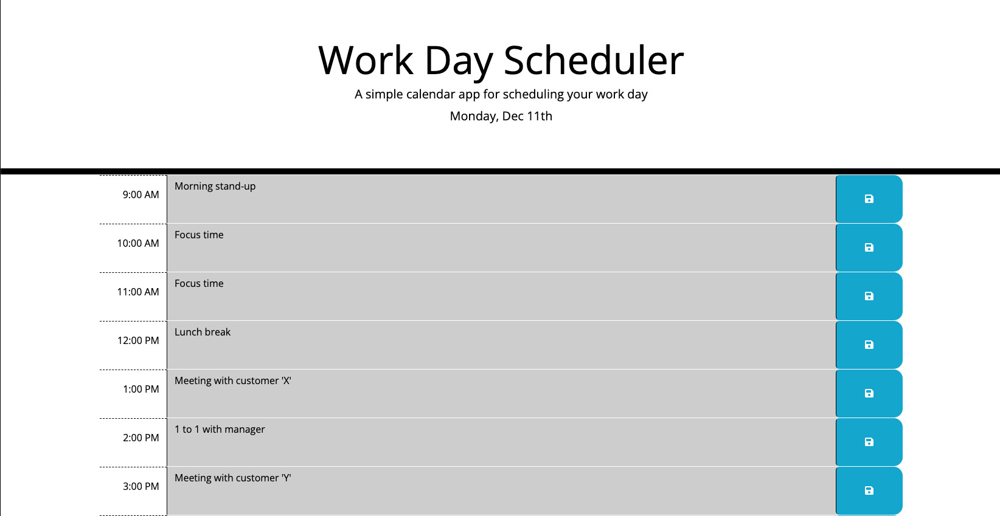

# Work Day Scheduler

## Description

This is a work day planner that employees with a busy schedule can use to add important events in order to manage their time effectively.

## Installation
No installation required.

## Usage
To access the application the user needs to navigate to [Work Day Scheduler](https://naike-b.github.io/Work-Day-Scheduler/).  
The user can see the current date at the top of the page.  
Each hour of the work day has its own line. Every time block is colour-coded based on the time of the day:
- Grey: past
- Red: present
- Green: future  

The colour of the time block is updated as the time passes.  
The user can add an event to the planner by clicking on one of the time blocks and typing the title of the event.  
The user can save the event entered, to the browser's local storage by clicking on the save button on the same line.  
To update an event, the user can click on the time block, delete the event title and then add a new one.  
Once that's done the event can be saved by clicking on the save button on the same line.  
If the user refreshes the page, the events saved will still be visible.

This is what the application looks like:

  

  

## License
Please refer to the license in the repository.

## Credits

I want to express my gratitude to my instructor, my teaching assistant and my tutors and my study group. They were very helpful and provided me with a lot of support to finish this application. 🚀

Resources:  
[Days.js - JavaScript library (Format)](https://day.js.org/docs/en/display/format#docsNav)  
[JavaScript parseInt()](https://www.w3schools.com/JSREF/jsref_parseint.asp)  
[Javascript String split()](https://www.javascripttutorial.net/javascript-string-split/)  
[Difference between $(this) and event.target?](https://stackoverflow.com/questions/12077859/difference-between-this-and-event-target)  
[.siblings()](https://api.jquery.com/siblings/#siblings-selector)  
[JQuery Click Event](https://api.jquery.com/click/#on-)  
[jQuery get textarea text](https://stackoverflow.com/questions/144810/jquery-get-textarea-text)  
[JQuery .val()](https://api.jquery.com/val/#val)  
[.ready()](https://api.jquery.com/ready/#ready-handler)  
[Window local storage](https://www.w3schools.com/jsref/prop_win_localstorage.asp)  

